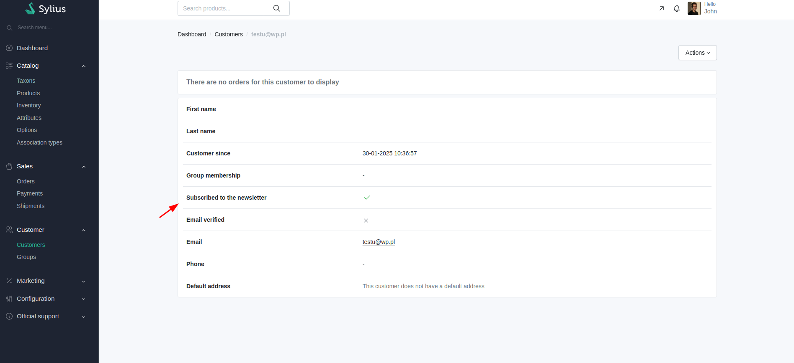
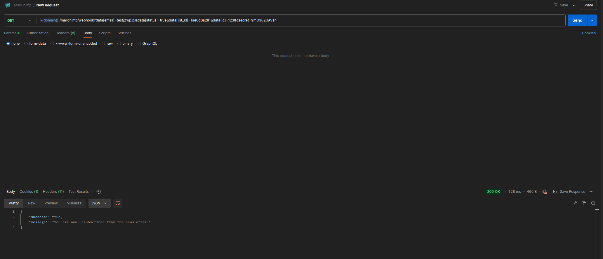

# Functionalities

---

This plugin integrates MailChimp newsletter sign-in process with Sylius platform

Once the plugin is installed, the basic newsletter form is displayed on the Homepage.

    

By using this form, user changes user's info about the fact if they're subscribed or not. 

    

User has the possibility to customize it according to their needs. More about it [here.](https://github.com/BitBagCommerce/SyliusMailChimpPlugin/blob/master/doc/customization.md)

Through the API it is also possible to unsubscribe by using GET request.

    

For list_id and qsecret values in the URL, user should use MAIL_CHIMP_LIST_ID and MAIL_CHIMP_WEBHOOK_SECRET values from the .env file.
