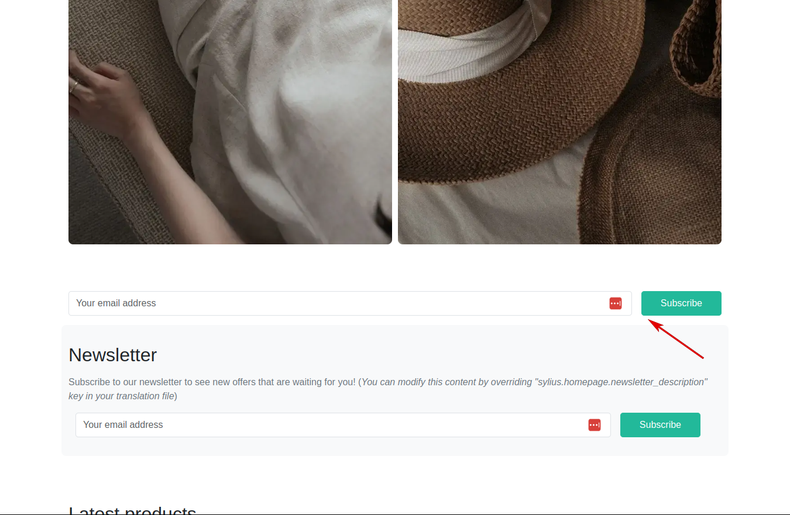

# Functionalities

---

This plugin integrates MailChimp newsletter sign-in process with Sylius platform

Once the plugin is installed, the basic newsletter form is displayed on the Homepage.

    

User has the possibility to customize it according to their needs. More about it [here.](https://github.com/BitBagCommerce/SyliusMailChimpPlugin/blob/master/doc/customization.md)

